# Create a serverless Solution  AWS Lambda and Amazon Transcribe
1. Create an IAM role which will be utilized by the Lambda function 

2. Trust Entity type, choose AWS Service and choose Lambda under the use case
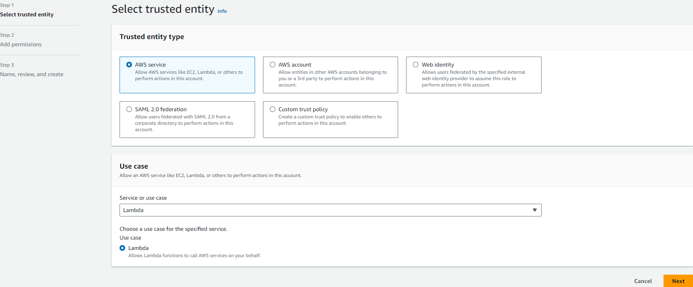
3. Grant permissions to the role. the permissions required for these are 
    - S3 full access permission
    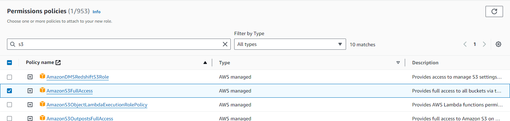
    - Transcribe Full access
    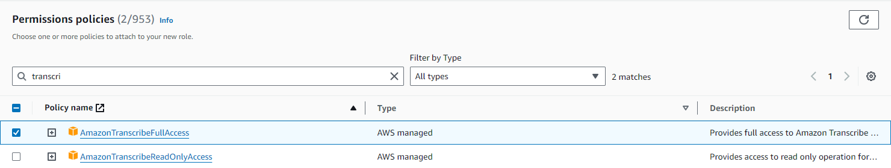
    - Cloudwatch full access
    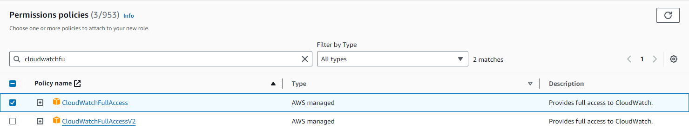
4. Give a name to the role 
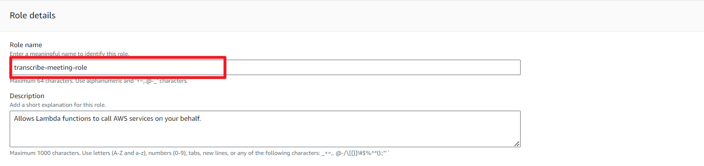
5. Search for Lambda under services
6. Create a function, choose Author from scratch, fill in the function name and specify the runtime. In ths case, we use python for the runtime
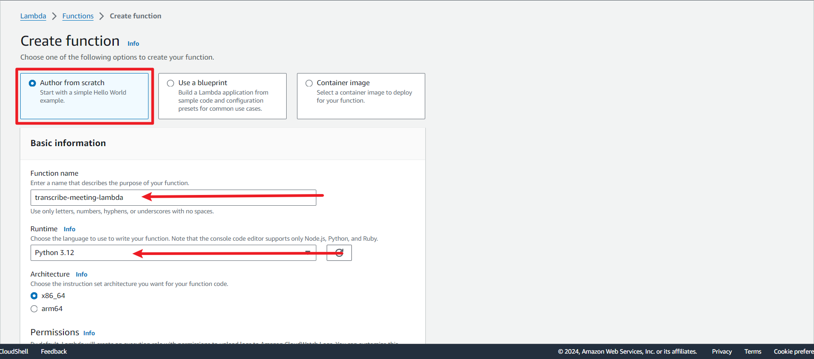
7. Change the default execution role and choose an existing role, from the dropdown menu, choose the role that was initially created
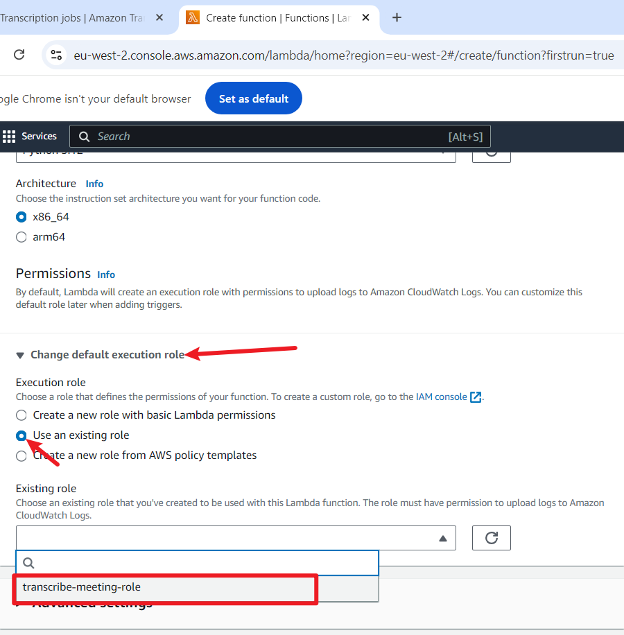
8. Under the code source section, delete the default code, paste the new code and click deploy 
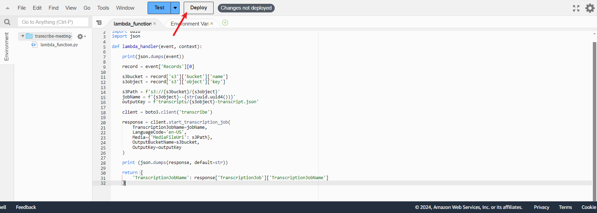
9. Search for S3 under services, and create a new S3 bucket using a unique name for the bucket

10. Click on your newly created bucket
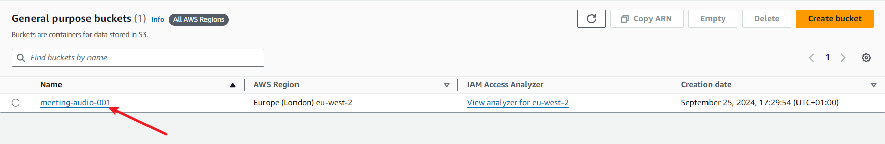
11. Go to the properties tab of your bucket 
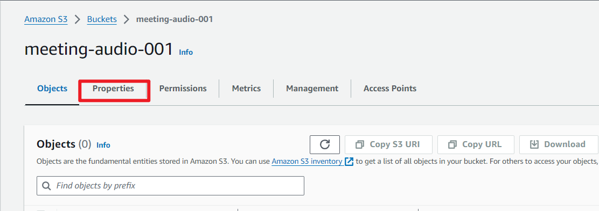
12. Under the properties tab, go to Event notifications and create an event notification
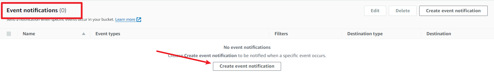
13. Enter an event name and a suffix for the type of file to use
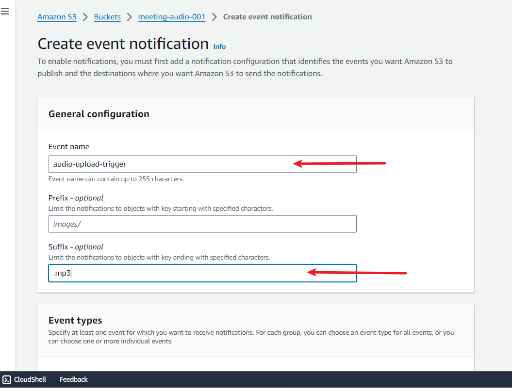
14. Under the event types, select 'All Object create events'

15. Scroll to destination and select lambda function and from the dropdown menu, choose your function
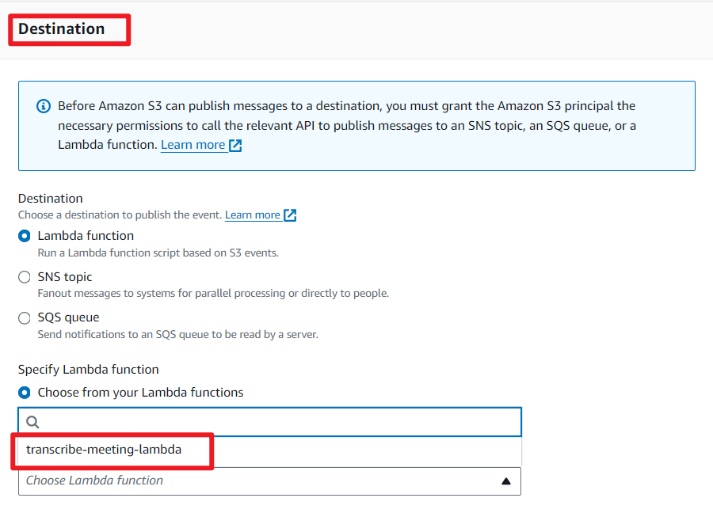
16. Go to objects and upload your file, this is the audio file that you intend to transcribe. 
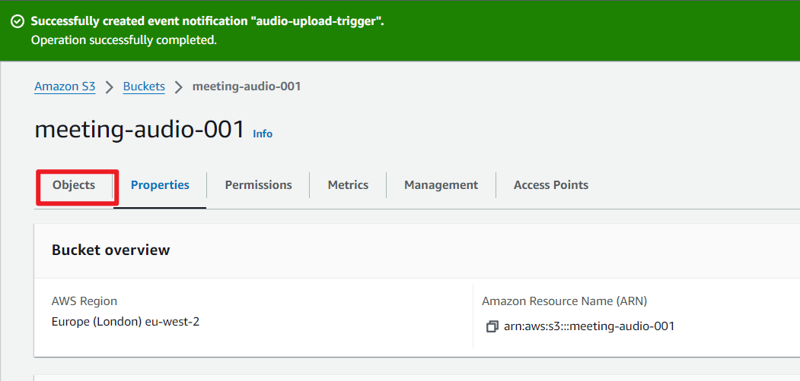
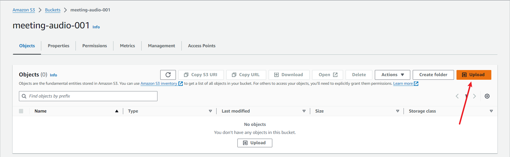
17. Search for CloudWatch under services, locate logs at the side menu and choose Log groups 
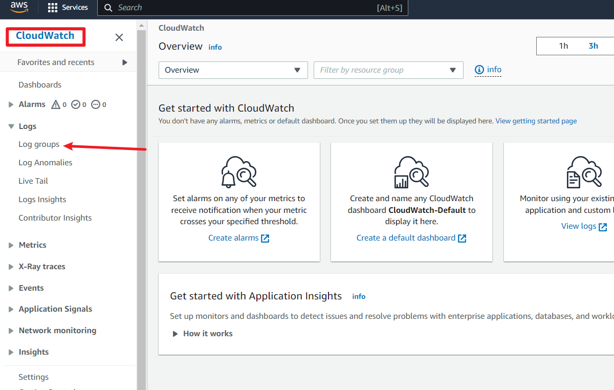
18. You will find log groups, click on the newly created log group 
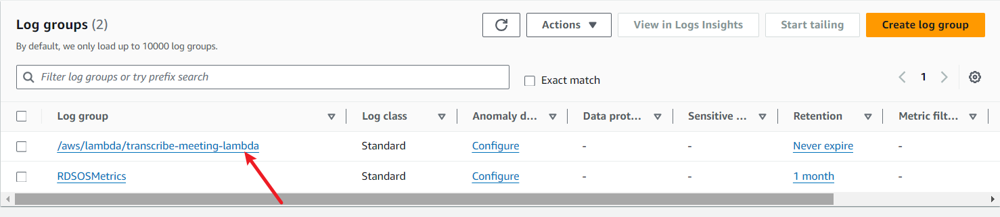
19. You will see the log stream, click the log stream to view the log 
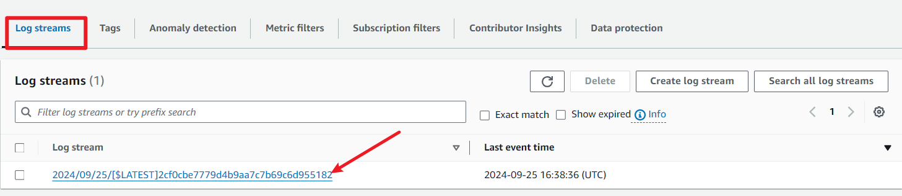
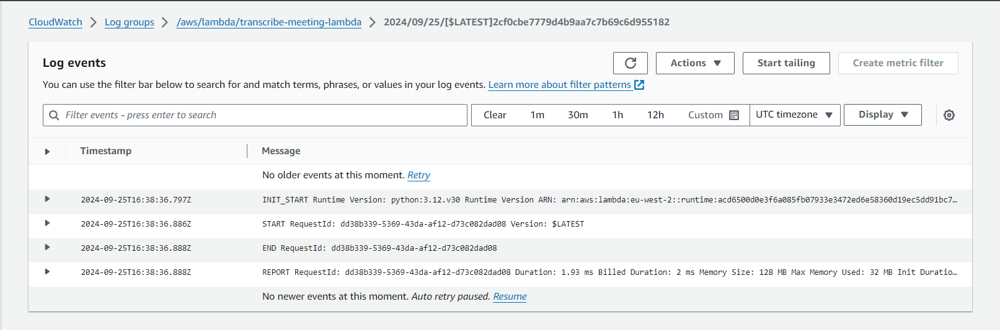
20. Search for Amazon Transcribe from the services menu, on the side bar, there is transcription jobs, click on it
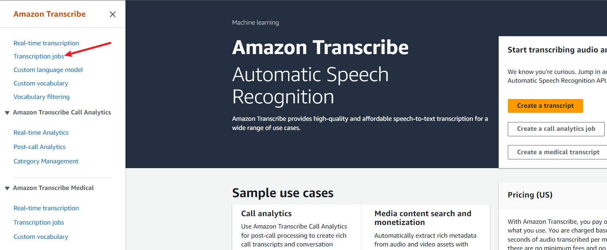
21. you will see a job with status complete
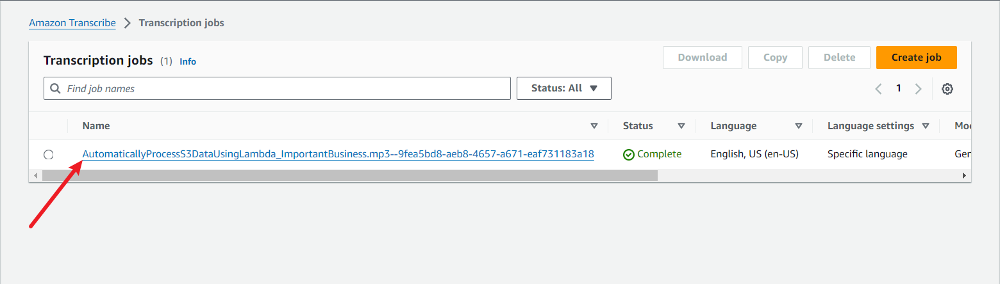
22. In the job details, you will the output data location.

23. Back to S3 bucket, click on your bucket 
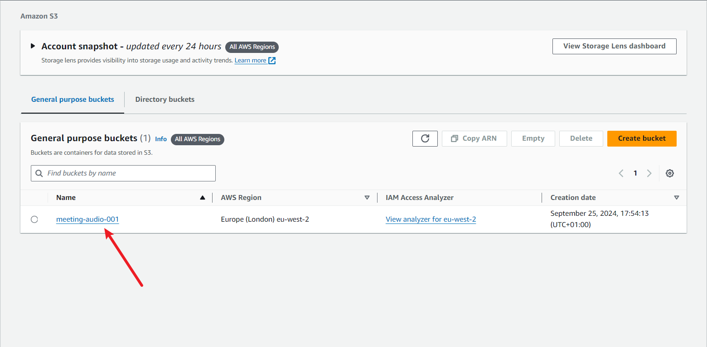
24. Inside the bucket, you will see a newly created folder called transcripts

25. Open the transcripts folder and download the file 
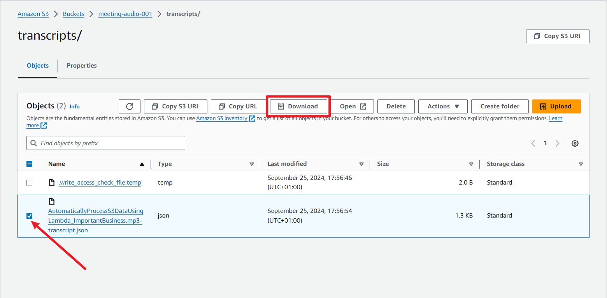
26. Using Gtbash for windows or terminal, change the directory to the directory where the file was downloaded, then run the python command on the file 
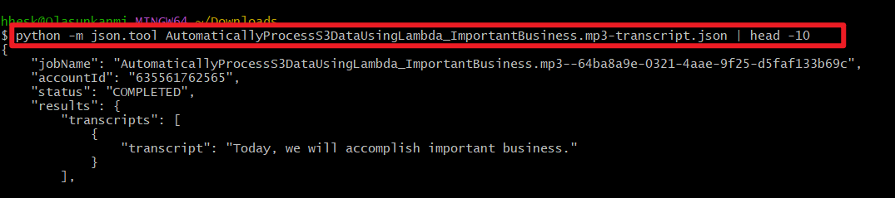
27. There you will see the transcript of the audio file 